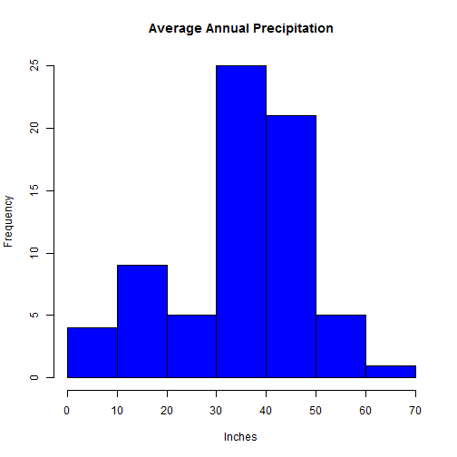

Data Products Course Project
========================================================
author: David Lucas
date: 4.21.15


========================================================

# Precipitation of Major U.S. Cities

## This App will give the average annual precipitation and percentile rank of the User's chosen city.


- This is taken from the R dataset "precip", which is from the 1975 U.S. Statistical Abstract survey of 
  70 largest Metropolitan Areas in the U.S. and Puerto Rico. Measurements are in inches.


========================================================
## The 70 cities listed in the "precip" data set.
<small>Albany,Albuquerque,Atlanta,Atlantic City,Baltimore,Bismark,
Boise,Boston,Buffalo,Burlington,Charleston,Charlotte,Cheyenne,
Chicago,Cincinati,Cleveland,Columbia,Columbus,Concord,Dallas,Denver,
Des Moines,Detroit,Duluth,El Paso,Great Falls,Hartford,Honolulu,
Houston,Indianapolis,Jackson,Jacksonville,Juneau,Kansas City,Little Rock,
Los Angeles,Louisville,Memphis,Miami,Milwaukee,Minneapolis/St Paul,Mobile,
Nashville,New Orleans,New York,Norfolk,Oklahoma City,Omaha,Peoria,
Philadelphia,Phoenix,Pittsburg,Portland,Portland,Providence,Raleigh,
Reno,Richmond,Sacramento,Salt Lake City,San Francisco,San Juan,Sault Ste. Marie,
Seattle Tacoma,Sioux Falls,Spokane,St Louis,Washington,Wichita,Wilmington</small>

 When using the app, take care to spell the cities exactly as those listed above.
 
 
========================================================
### The average annual inches of precipitation for all cities in the data set is:

```
[1] 34.88571
```


### Here's a basic histogram of the average annual precipitation of the 70 cities in the data set.
### Where does your favorite city rank?
 

=======================================================
### Go Ahead! Try the app! It's fun and educational! :)

Are you an orchid farmer that wants a humid climate?
Are you a sun worshipper that wants a bone dry vacation spot?
Find your ideal city with this App!
